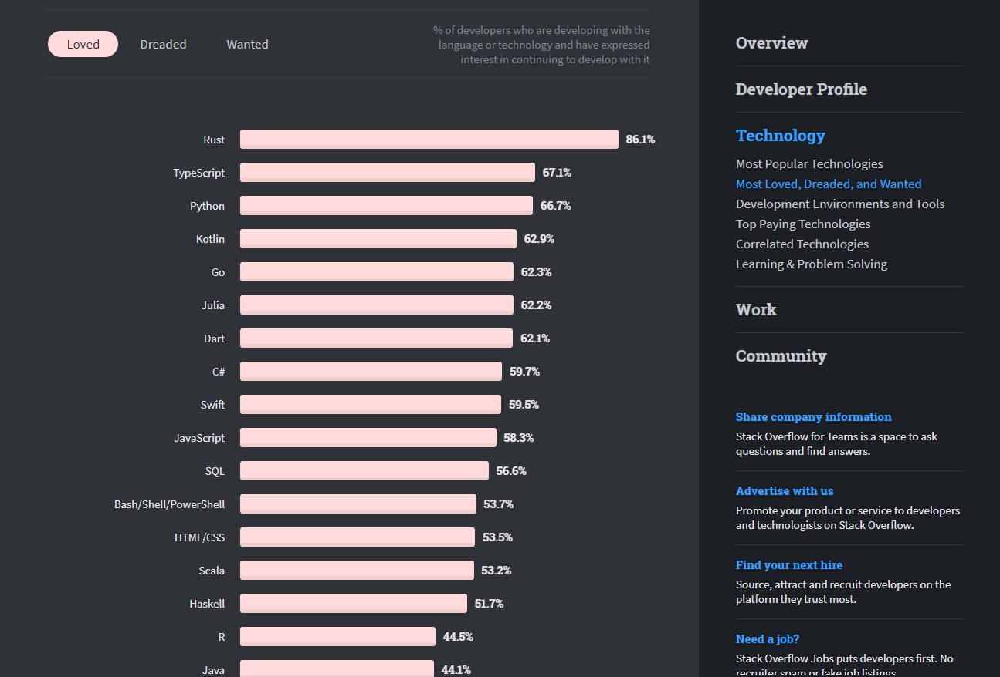
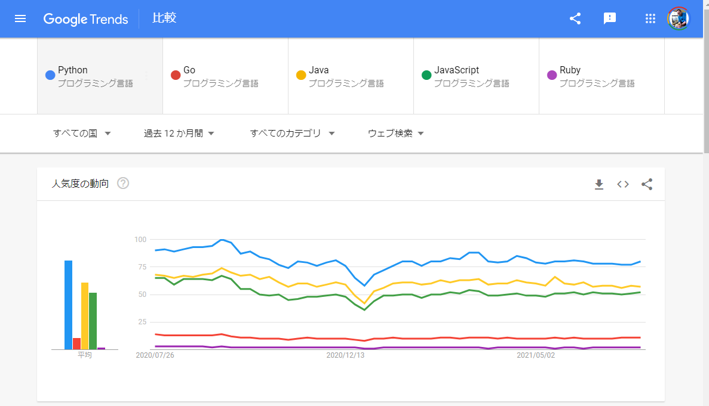
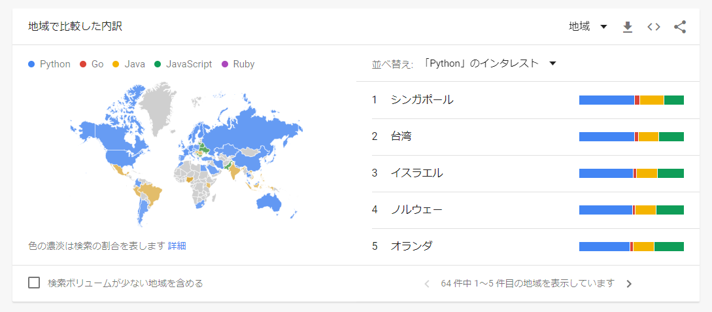

はじめてのPython
===

Pythonとは
---

Python（パイソン）は、オープンソースのインタープリター型プログラミング言語の一つで、コードの可読性を高めた言語です。

Pythonは、読みやすく、効率よいコードをなるべく簡単に書けるようにするという思想があり、誰が書いても同じようなコードになるように設計されている。
Phthonの開発者は、イギリスBBCのコメディ番組『空飛ぶモンティ・パイソン（Monty Python's Flying Circus）』のファンで、それが名前の由来といわている。Pythonという単語は辞書で引くと「ニシキヘビ」となっている。

Pythonの最初に覚えなければならない文法はそれほど多くないといわれているので、初心者でもハードルが低くとっつきやすい言語といわれているが、
他のインタプリタ言語と比較して実行速度が遅いというデメリットがあり、システム開発時はその点を注意してプログラミングをする必要がある。

Pythonは「データサイエンス」や「統計」系の外部ライブラリが豊富であったこともあり、機械学習やAI開発の分野で広く使われるようになった。また、地理空間情報の分野でも広くPythonは使われている。
データサイエンスやデータ分析等に携わりたいのであれば「線形代数」や「統計学」の数学的の知識が必須である。

Pythonにはバージョン2とバージョン3の2つの系統が存在している。バージョン2とバージョン3は互換性がなく、バージョン2については2020年にサポートが終了しているので、バージョン2を使用しなければならない理由がなければ、バージョン3を使用することを強くおススメする。

Pythonのサイト
---

### Python公式サイト
* [Python公式](https://www.python.org/)
    * [Python3ドキュメント](https://docs.python.org/ja/3/)
    * [Pythonダウンロード](https://www.python.org/downloads/)
    * [Python チュートリアル](https://docs.python.org/ja/3/tutorial/)
* [Python.jp](https://www.python.jp/)
### Google Colaboratory
* [Google Colaboratory](https://colab.research.google.com/)
### Python教材
* [Pythonプログラミング入門 #utpython 2021年度S1](https://sites.google.com/view/ut-python/resource/%E6%95%99%E6%9D%90%E8%AC%9B%E7%BE%A9%E5%8B%95%E7%94%BB)
  * [Colab教材目次](https://colab.research.google.com/github/utokyo-ipp/utokyo-ipp.github.io/blob/master/colab/index.ipynb)
  * [HTML版](https://utokyo-ipp.github.io/index.html)
  * [PDF版](https://utokyo-ipp.github.io/IPP_textbook.pdf)
  * [Jupyter版](https://sites.google.com/view/ut-python/resource/%E6%95%99%E6%9D%90%E8%AC%9B%E7%BE%A9%E5%8B%95%E7%94%BB)

* 慶応義塾大学理工学部物理情報工学科の講義「プログラミング基礎同演習」
  * [ゼロから学ぶPython（@kaityo256 先生）](https://kaityo256.github.io/python_zero/)

### 参考教材
* [文科省高等学校情報科](https://www.mext.go.jp/a_menu/shotou/zyouhou/detail/1416746.htm)
* [奥村 晴彦 - 三重大学教育学部特任教授](https://oku.edu.mie-u.ac.jp/~okumura/python/)

---

プログラム言語のトレンド
---
下記は、世界中のプログラマーの開発者コミュニティである、Stack Overflowからリリースされた2020年度のレポートである。

* [Stack Overflow Developer Survey 2020](https://insights.stackoverflow.com/survey/2020)

過去5年間で一貫して人気のあったPythonは、TypeScriptに負けて「最も愛されているテクノロジーのリスト」で2番目か3番目に落ちた。
Rustは、5年連続で「最も愛されているテクノロジーのトップを守った。

<figure>
<a href="https://insights.stackoverflow.com/survey/2020/#technology-most-loved-dreaded-and-wanted-languages-loved">
Stack Overflow Developer Survey 2020 - 最も人気のあるテクノロジー</a>
</figure>
<a href="https://insights.stackoverflow.com/survey/2020/#technology-most-loved-dreaded-and-wanted-languages-loved">
  

    
  

</a>

Python以外の開発言語としては、動的型付け言語の「TypeScript」が人気で、静的型付け言語であれば「Go」が開発者に人気がある。大規模の業務系であれば「Java」や「Scala」の需要はまだまだあると思われる。「Rust」はC/C++の置き換えとして注目されている
「Ruby」は日本国内のサービスでは選択されるこどが多いが、海外の世界レベルではあまり注目されていない。  

<figure>
<a href="https://trends.google.com/trends/explore?q=%2Fm%2F05z1_,%2Fm%2F09gbxjr,%2Fm%2F07sbkfb,%2Fm%2F02p97,%2Fm%2F06ff5">
Google Trends 比較 (2021/07/25検索)</a>
</figure>

<a href="https://trends.google.com/trends/explore?q=%2Fm%2F05z1_,%2Fm%2F09gbxjr,%2Fm%2F07sbkfb,%2Fm%2F02p97,%2Fm%2F06ff5">
  

    
  

</a>

<a href="https://trends.google.com/trends/explore?q=%2Fm%2F05z1_,%2Fm%2F09gbxjr,%2Fm%2F07sbkfb,%2Fm%2F02p97,%2Fm%2F06ff5">
  

    
  

</a>

* [TIOBE Index for July 2021](https://www.tiobe.com/tiobe-index/)