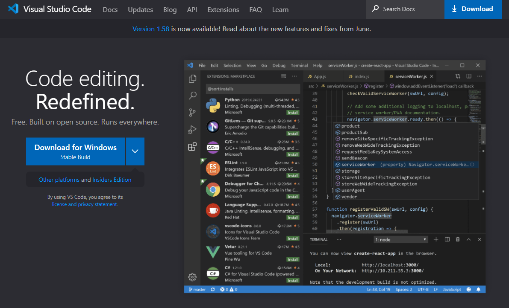
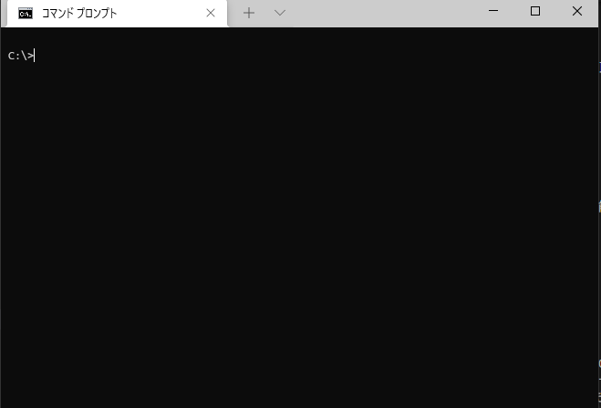

はじめてのPython
===

Pythonとは
---

Python（パイソン）は、オープンソースのインタープリター型プログラミング言語の1つで、コードの可読性を高めた言語です。

Pythonは、読みやすく、効率よいコードをなるべく簡単に書けるようにするという思想があり、誰が書いても同じようなコードになるように設計されている。
Phthonの開発者は、イギリスBBCのコメディ番組『空飛ぶモンティ・パイソン（Monty Python's Flying Circus）』のファンで、それが名前の由来といわています。Pythonという単語は辞書で引くと「ニシキヘビ」となっています。

Pythonの最初に覚えなければならない文法はそれほど多くないといわれているので、初心者でもハードルが低くとっつきやすい言語といわれているが、
他のインタプリタ言語と比較して実行速度が遅いというデメリットがあり、システム開発時はその点を注意してプログラミングをする必要があります。

Pythonは「データサイエンス」や「統計」系の外部ライブラリが豊富であったこともあり、機械学習やAI開発の分野で広く使われるようになった。また、地理空間情報の分野でも広くPythonは使われています。
データサイエンスやデータ分析等に携わりたいのであれば「線形代数」や「統計学」の数学的の知識が必須です。

Pythonにはバージョン2とバージョン3の2つの系統が存在している。バージョン2とバージョン3は互換性がなく、バージョン2については2020年にサポートが終了しているので、バージョン2を使用しなければならない理由がなければ、バージョン3を使用することを強くおススメします。

Python公式サイト
---
Pythonを学習する際には、公式サイトやユーザーコミュニティから情報を得るとよいと思います。

* [Pythonの公式サイト](https://www.python.org/)
    * [Python3ドキュメント](https://docs.python.org/ja/3/)
    * [Pythonダウンロード](https://www.python.org/downloads/)
    * [Python チュートリアル](https://docs.python.org/ja/3/tutorial/)
* [PyLadies - 女性のPythonコミュニティ](https://pyladies.com/)

### Django - PythonのWebフレームワーク
* [Djangoの公式サイト](https://www.djangoproject.com/)
  * [The Django Book](https://djangobook.com/)
* [DjangoGirls - 女性のDjangoコミュニティ](https://djangogirls.org/)
  * [Django Girls のチュートリアル](https://tutorial.djangogirls.org/ja/)

### 日本のユーザーコミュニティ
* [Python.jp - 日本のPythonコミュティ](https://www.python.jp/)
* [django-ja - 日本のDjangoコミュティ](https://djangoproject.jp/)
* [PyLadies Tokyo - PyLadies の東京(or 日本!?)支部。女性のPythonコミュニティ](https://pyladies-tokyo.connpass.com/)
* [Django Girls Japan - Djangoの東京(or 日本!?)支部。女性のDjangoコミュニティ](https://djangogirls.org/tokyo/)
  * [DjangoGirls Japan イベントサイト](https://djangogirls-org.connpass.com/)

---
プログラム言語のトレンド
---
下記は、世界中のプログラマーの開発者コミュニティである、Stack Overflowからリリースされた2020年度のレポートです。

* [Stack Overflow Developer Survey 2020](https://insights.stackoverflow.com/survey/2020)

過去5年間で一貫して人気のあったPythonは、TypeScriptに負けて「もっとも愛されているテクノロジーのリスト」で2番目か3番目に落ちました。
Rustは、5年連続で「もっともも愛されているテクノロジーのトップを守っています。

<figure>
<a href="https://insights.stackoverflow.com/survey/2020/#technology-most-loved-dreaded-and-wanted-languages-loved">
Stack Overflow Developer Survey 2020 - 最も人気のあるテクノロジー</a>
</figure>
<a href="https://insights.stackoverflow.com/survey/2020/#technology-most-loved-dreaded-and-wanted-languages-loved">
  

    
  

</a>

Python以外の開発言語としては、動的型付け言語の「TypeScript」が人気で、静的型付け言語であれば「Go」が開発者に人気がある。大規模の業務系であれば「Java」や「Scala」の需要はまだまだあると思われる。「Rust」はC/C++の置き換えとして注目されていて、Linuxのカーネル開発言語はC言語ですが、Rustも使う事を検討されだしています。「Ruby」は日本国内のサービスでは選択されるこどが多いが、海外の世界レベルではあまり注目されていません。

<figure>
<a href="https://trends.google.com/trends/explore?q=%2Fm%2F05z1_,%2Fm%2F09gbxjr,%2Fm%2F07sbkfb,%2Fm%2F02p97,%2Fm%2F06ff5">
Google Trends 比較 (2021/07/25検索)</a>
</figure>

<a href="https://trends.google.com/trends/explore?q=%2Fm%2F05z1_,%2Fm%2F09gbxjr,%2Fm%2F07sbkfb,%2Fm%2F02p97,%2Fm%2F06ff5">
  

    
  

</a>

<a href="https://trends.google.com/trends/explore?q=%2Fm%2F05z1_,%2Fm%2F09gbxjr,%2Fm%2F07sbkfb,%2Fm%2F02p97,%2Fm%2F06ff5">
  

    
  

</a>

* [TIOBE Index for July 2021](https://www.tiobe.com/tiobe-index/)

開発環境
----
Pythonに限らずテキストベースのプログラミング言語を使って開発をする場合はパソコンが必要になります。
Pythonを学習する場合はテキストベースでの開発となるのでパソコンを用意してください。

タブレット／スマートフォンの開発環境は整ってきていますが、[Scratch](https://scratch.mit.edu/)等のビジュアルプログラミング言語を使う場合が多いと思われます。タブレット／スマートフォンを使用してPythonの学習することは不可能でないですが現時点ではおススメしていません。

コードエディターと開発環境（IDE）
----
パソコンで文章を作成するときには、Microsoft WordやGoogle Document等のアプリケーションを使って作成しますが、
Pythonに限らずプログラミング言語のコードを編集する時はコードエディターを使用します。
Notepadやメモ帳でもコードを編集することはできますが、コードを編集するのに便利な機能のついたコードエディターを使用します。
また、Microsoft WordやGoogle Documentで保存するファイルは、文字の書式や装飾やフォント情報等を付与したファイルになってしまうためコードを実行することができません。
コードを実行するには、プレーンテキストという何も修飾の付かないファイルである必要があります。

コードエディターはたくさんの種類があります。自分の好みのものを見つける事をおススメします。
近年は、コード編集に加えてデバック機能などのついた統合開発環境（IDE）で開発することが好まれてます。
下記に代表的なコードエディターを例に挙げます。

### Visual Studio Code
マイクロソフトが開発した無料のコードエディターです。
Windows, Mac, Linux版があり、拡張機能をインストールすることで統合開発環境（IDE）としても使用できます。

* [Visual Studio Code](https://code.visualstudio.com/)
  * [ダウンロード](https://code.visualstudio.com/Download)

    

### PyCharm
Pythonでの開発に特化した、 JetBrains社の統合開発環境（IDE）です。
Windows、Mac、Linux版があり、フル機能のProfessional版（有料）、または一部機能制限のあるCommunity版（無料）があります
Community版でもPythonの開発には十分な機能が使えます。

* [PyCharm Community](https://www.jetbrains.com/ja-jp/pycharm/)
  * [ダウンロード](https://www.jetbrains.com/ja-jp/pycharm/download/)

    

コマンドライン
----
プログラミング言語で開発するときには、ターミナル、コマンドプロンプトまたはPowerShellと呼ばれる黒い画面（青？）でコマンドを入力する必要があります。
コマンドライン あるいは コマンドライン インターフェイスと呼ばれこの画面はキーボードから入力したテキストで指示（命令）を出してコンピューターと直接対話をします。パソコンのOSによって入力するコマンドが若干違いますので注意してください。

    

Pythonの拡張ソフトウエア
----
プログラミング言語であるPythonには、Pythonの利用者やコミュニティーが作成したたくさんの拡張ソフトウエアがあり、自由に利用できるようになってます。
Pythonは科学計算や統計の拡張ソフトウエアが豊富にあることからAIや機械学習、地理空間情報の分野で選択されています。
Pythonを使った開発では、この膨大な拡張ソフトウエアを使いこなすことが必要となります。

拡張ソフトウエアのインストールや管理にはPyPIとAnacondaの2つがあります。
拡張ソフトウエアの管理方法が違うため、2つを同時に使用することは難しいので、目的によってどちらかを選択することになります。

* [The Python Package Index(PyPI)](https://pypi.org/)
  * 「pip」「venv」等のコマンドを使用します
* [Anaconda](https://www.anaconda.com/)
  * 「conda」というコマンドを使用します

通常の開発では「PyPI」、データサイエンスや機械学習などでJupyter Notebook等を使う場合には、Anacondaを使用する事が多いようです。
