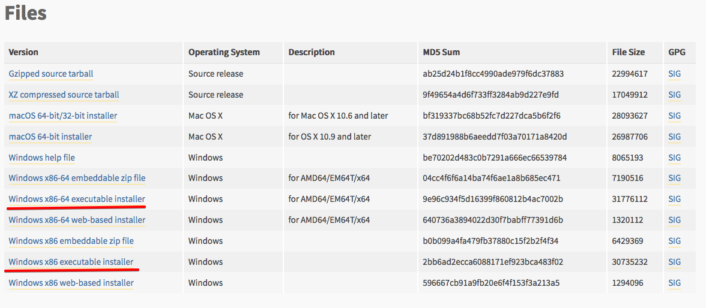
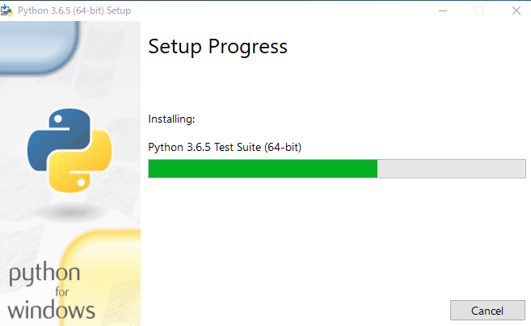
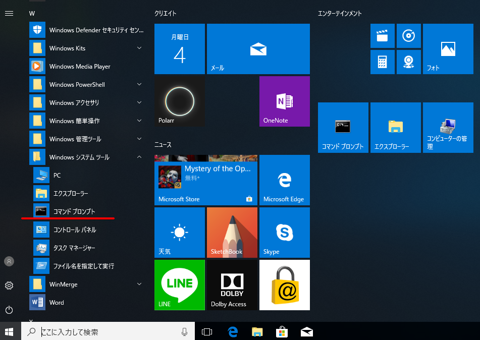
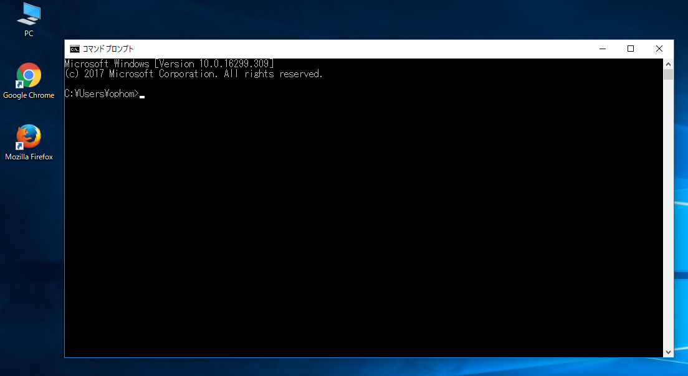
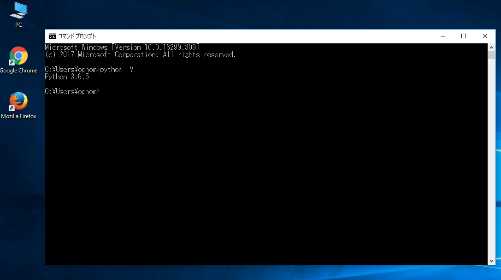

Windows10のPythonのインストール
========

Python 3.6のインストール方法の説明をWidowsとMac(OSX)の環境で説明します
* python.jpの環境構築ガイド - https://www.python.jp/install/install.html
* Python Boot Campのテキスト - http://pycamp.pycon.jp/textbook/1_install.html

### **<u>Windows</u>**

Windowsのシステム情報でシステムの種類が32-bitバージョンか64-bitバージョンかを確認してください。  
(例）コントロールパネル>システムとセキュリティ>システムを開く

    

Python for Windowsを <https://www.python.org/downloads/windows/>　から最新版の「Latest Python 3 Release - Python 3.6.5」(2018年6月4日現在)をダウンロードしてください。

    Python Releases for Windows    
        Latest Python 3 Release - Python 3.6.5
        Latest Python 2 Release - Python 2.7.15

    

Widnowsの環境によってダウンロードするファイルが違いますのでご注意ください。
* 64ビット版のWindowsの場合
    -  "Windows x86-64 executable installer" (Windows x86-64実行可能インストーラー)をダウンロードしてください。 
* 32ビット版のWindowsの場合 
    - "Windows x86 executable installer" (x86実行可能インストーラー)をダウンロードしてください

    

インストーラをダブルクリックして実行します。ダイアログが表示されるので、
「Add Python 3.x to Path」を忘れずに必ずチェックしてから「Install Now」をクリックします。

    

インストーラーが実行されるので、終了まで待ちます。

    

インストーラーが終了するとダイアログが表示されるので「Close」ボタンをクリックして終了します。

    

コマンドプロンプトを実行します。  
例）スタートメニュー→すべてのプログラム→アクセサリ→コマンドプロンプト

    

コマンドプロンプトが実行されます。

    

「python -V」を入力して、Pythonがインストールされたバージョンを確認します。

    例）python -V

    

<u>**注意**</u> 
パソコンの環境によって「python」ではなく「python3」となる場合があります。パソコンの環境を確認ください。「python3」だった場合はこれ以降は「python」を「python3」と読みかえてください

    例）$ python3 -V

pipのバージョンも確認します。pipも、Pythonと同様に環境によりpip3となる場合があります。これも「pip」を「pip3」と読みかえてください

    $ pip3 --version
    pip 9.0.3 from xxx (python 3.6)

